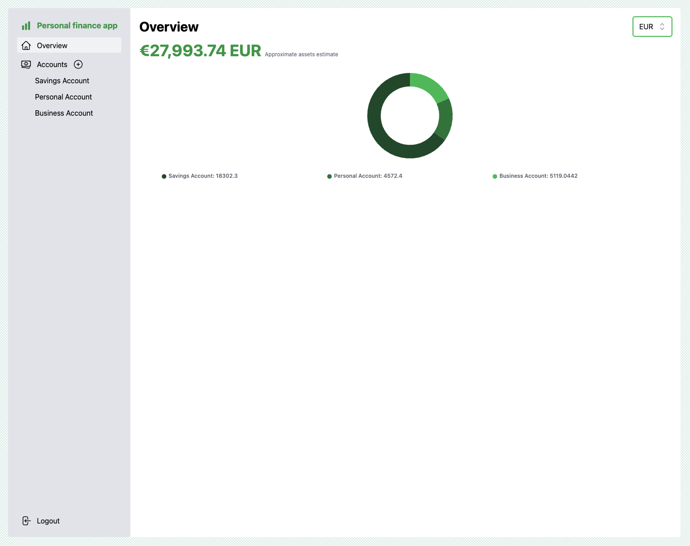
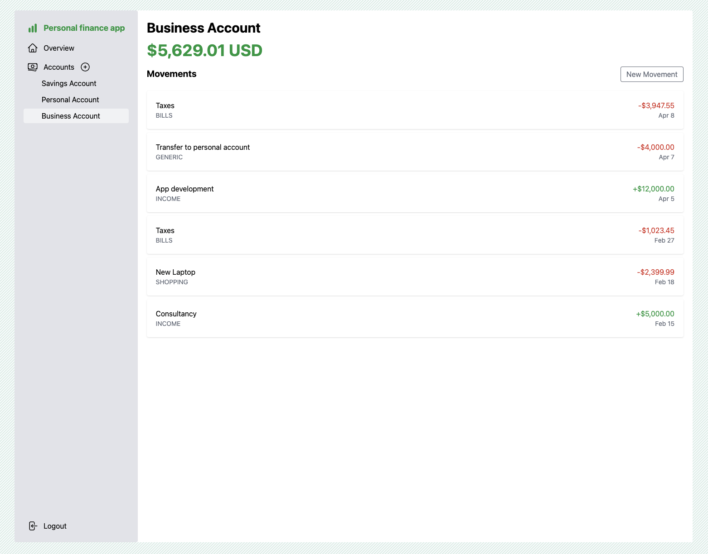

# Personal finance app

A simple finance app built with with SvelteKit and Rust.

    
    

### Run the app

- `docker compose up -d`
- Visit [localhost](http://localhost)
- Visit [mailcatcher](http://localhost:1080) for your OTPs

## Technologies

### [Frontend](./web/)

- `Sveltekit`
- `Typescript`
- `Tanstack Query`
- `Svelte Forms Lib`
- `Tailwind`
- `Frappe Charts`
- `Heroicons`

### [Backend](./api/)

- `Rust`
- `Axum`
- `Sqlx`
- `Paseto`
- `Mockall`
- `Postgres`
- `Redis`
- `SMTP`

### Putting it all together

- `Docker`
